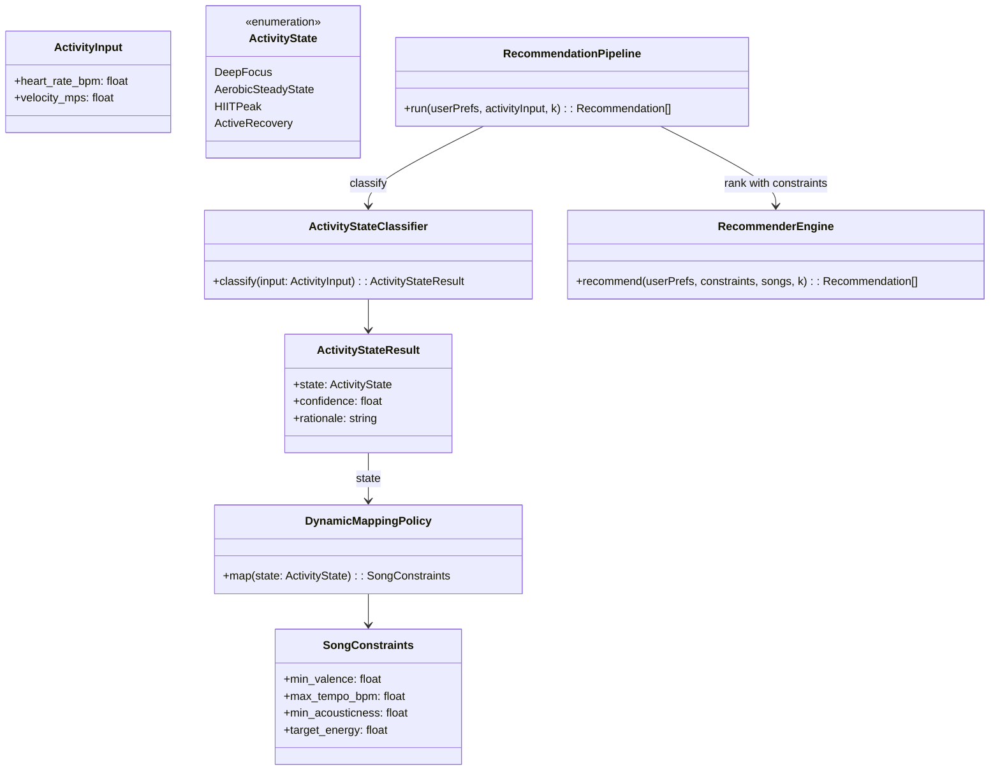
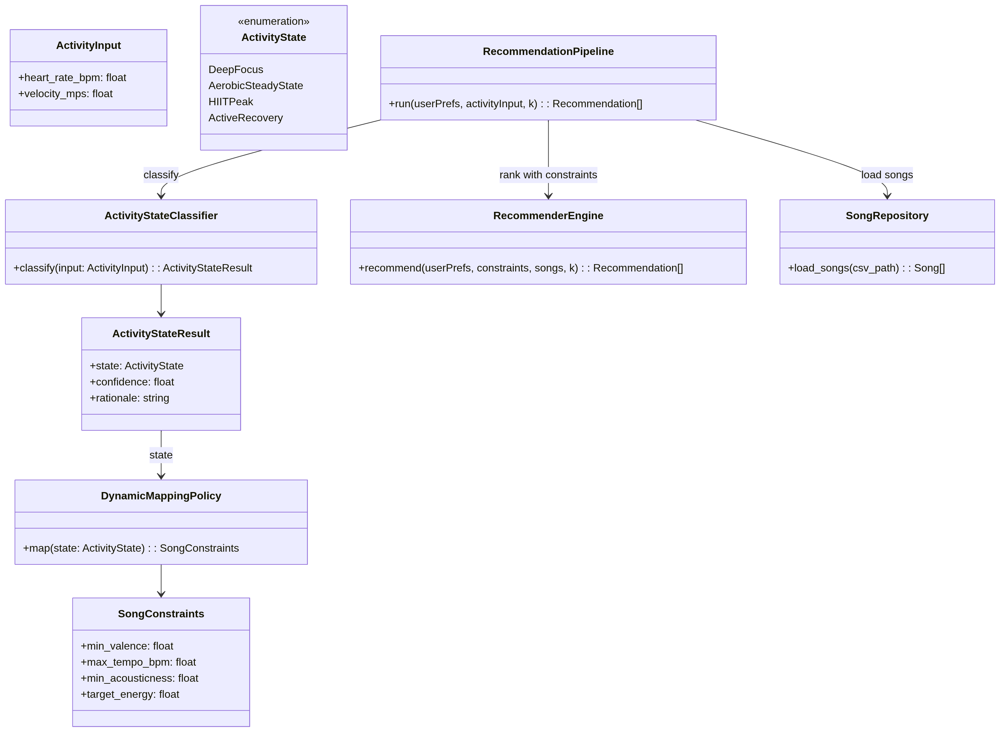

# 🎵 Music Recommender Simulation

## Project Summary

This project builds an explainable, classifier-first music recommender.
The system first infers a physical activity state from two biometric inputs:

- Heart Rate (BPM)
- Velocity (m/s)

Then it maps that state to target song constraints and ranks songs by a combined score.
Recommendation is now a downstream result of primary context understanding.

---

## How The System Works

This recommender has two stages.

### Stage 1: Activity-State Classification

A rule-based baseline classifier receives:

- heart_rate_bpm
- velocity_mps

And predicts one of four classes:

- Deep Focus
- Aerobic Steady-State
- HIIT Peak
- Active Recovery

Example logic:

- High heart rate + low velocity -> Deep Focus
- High heart rate + high velocity -> HIIT Peak

### Stage 2: Dynamic Mapping + Recommendation

The predicted state is translated into song constraints. For example, Active Recovery sets:

- Valence >= 0.70
- Tempo <= 100 BPM
- Acousticness >= 0.50
- Target energy near 0.35

These constraints are added as state-aware scoring bonuses on top of the original user-preference scoring.

### Song features used in scoring

- Genre, mood, energy, acousticness
- Popularity, release decade, mood tags
- Instrumentalness, liveness, speechiness
- Time signature

### User profile fields

- favorite_genre
- favorite_mood
- target_energy
- likes_acoustic
- preferred_decades (optional)
- preferred_mood_tags (optional)
- speechiness_tolerance (optional)
- preferred_time_signature (optional)

### Scoring logic (plain language)

Each song gets points from user-preference fit and activity-state constraints.

Core checks include:

1. Genre and mood match
2. Energy closeness to profile target
3. Acoustic preference fit
4. Popularity normalization
5. Era fit and mood-tag overlap
6. Instrumentalness/liveness/speechiness fit
7. Optional time-signature match
8. State-constraint bonuses (valence/tempo/acousticness/energy)

Then all songs are sorted by total score, and the top K are returned.

### Why some songs can repeat

Energy and popularity still contribute strongly, and constraint-compatible songs may surface repeatedly.
This can reduce diversity if many songs share similar feature patterns.

### Mermaid UML (Current Architecture)



### Screenshots

<!--  -->

Example of normal user profile output:


Example of Edge/Adversarial user profile outputs:


---

## Getting Started

### Setup

1. Create a virtual environment (optional but recommended):

```bash
python -m venv .venv
source .venv/bin/activate      # Mac or Linux
.venv\Scripts\activate         # Windows
```

2. Install dependencies:

```bash
pip install -r requirements.txt
```

3. Run the app:

```bash
python src/main.py
```

The app currently uses a fixed sample biometric input in `src/main.py`:

- Heart Rate: 104.0 BPM
- Velocity: 0.85 m/s

### Running Tests

Run the starter tests with:

```bash
pytest
```

You can add more tests in `tests/test_recommender.py`.

---

## Experiments You Tried

- I tested profile-only ranking vs classifier-first ranking.
- I validated state boundaries (for example, high HR + low velocity -> Deep Focus).
- I verified Active Recovery mapping enforces low tempo and higher valence/acousticness preferences.
- I added tests for classification, mapping, and an end-to-end activity-aware recommendation case.

---

## Limitations and Risks

- The classifier is rule-based, not yet a trained RF/GBM model.
- The catalog is still limited (100 rows) and synthetic-style distributions may bias outcomes.
- Exact genre matching is strict (for example, pop vs indie pop receives no partial credit).
- Feature weighting can still reduce diversity in top results.
- Inputs are currently single-point values; no smoothing window is used for noisy sensors.

---

## Reflection

Read and complete `model_card.md`:

[**Model Card**](model_card.md)

Write 1 to 2 paragraphs here about what you learned:

- about how recommenders turn data into predictions
- about where bias or unfairness could show up in systems like this

