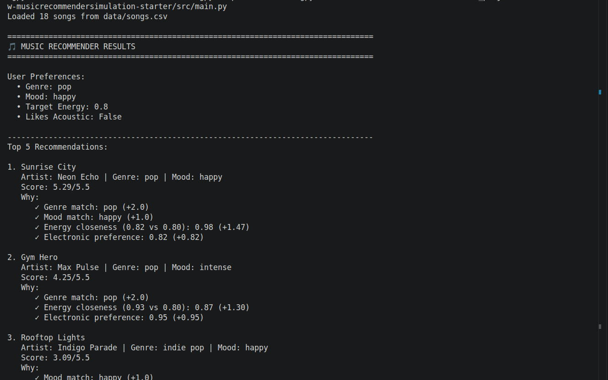

# 🎵 Music Recommender Simulation

## Project Summary

This project builds a simple, explainable music recommender for a small song catalog.
The system scores each song against a user profile, ranks songs by score, and returns the top results.
I tested normal and adversarial profiles to see where the logic works well and where bias appears.

---

## How The System Works

This recommender uses a weighted scoring rule.

### Song features used

- Genre
- Mood
- Energy
- Acousticness

### User profile fields

- favorite_genre
- favorite_mood
- target_energy
- likes_acoustic

### Scoring logic (plain language)

Each song gets points from four checks:

1. Genre match: +1 point
2. Mood match: +1 point
3. Energy closeness: up to +3 points
4. Acoustic preference fit: up to +1 point

Then all songs are sorted by total score, and the top K are returned.

### Why some songs repeat

Energy currently has the biggest weight, so high-energy songs can appear often across profiles.
That is why songs like Gym Hero can keep showing up for users who ask for Happy Pop.

### Screenshots



Example of normal user profile output:



Example of Edge/Adversarial user profile outputs:

      

---

## Getting Started

### Setup

1. Create a virtual environment (optional but recommended):

```bash
python -m venv .venv
source .venv/bin/activate      # Mac or Linux
.venv\Scripts\activate         # Windows
```

2. Install dependencies:

```bash
pip install -r requirements.txt
```

3. Run the app:

```bash
python -m src.main
```

### Running Tests

Run the starter tests with:

```bash
pytest
```

You can add more tests in `tests/test_recommender.py`.

---

## Experiments You Tried

- I reduced genre weight from 2.0 to 1.0.
- I increased energy weight from 1.5 to 3.0.
- I tested six profiles, including adversarial profiles with missing or conflicting preferences.
- I compared profile pairs to see how ranking changed.
- I observed that high-energy songs were repeatedly promoted across multiple profiles.

---

## Limitations and Risks

- The catalog is very small (18 songs), so coverage is limited.
- Exact genre matching is strict, so related genres (for example, pop vs indie pop) do not partially match.
- Energy can dominate ranking and reduce diversity in top results.
- The system does not use lyrics, listening history, or context.

---

## Reflection

Read and complete `model_card.md`:

[**Model Card**](model_card.md)

Write 1 to 2 paragraphs here about what you learned:

- about how recommenders turn data into predictions
- about where bias or unfairness could show up in systems like this


---

## 7. `model_card_template.md`

Combines reflection and model card framing from the Module 3 guidance. :contentReference[oaicite:2]{index=2}  

```markdown
# 🎧 Model Card - Music Recommender Simulation

## 1. Model Name

Give your recommender a name, for example:

> VibeFinder 1.0

---

## 2. Intended Use

- What is this system trying to do
- Who is it for

Example:

> This model suggests 3 to 5 songs from a small catalog based on a user's preferred genre, mood, and energy level. It is for classroom exploration only, not for real users.

---

## 3. How It Works (Short Explanation)

Describe your scoring logic in plain language.

- What features of each song does it consider
- What information about the user does it use
- How does it turn those into a number

Try to avoid code in this section, treat it like an explanation to a non programmer.

---

## 4. Data

Describe your dataset.

- How many songs are in `data/songs.csv`
- Did you add or remove any songs
- What kinds of genres or moods are represented
- Whose taste does this data mostly reflect

---

## 5. Strengths

Where does your recommender work well

You can think about:
- Situations where the top results "felt right"
- Particular user profiles it served well
- Simplicity or transparency benefits

---

## 6. Limitations and Bias

Where does your recommender struggle

Some prompts:
- Does it ignore some genres or moods
- Does it treat all users as if they have the same taste shape
- Is it biased toward high energy or one genre by default
- How could this be unfair if used in a real product

---

## 7. Evaluation

How did you check your system

Examples:
- You tried multiple user profiles and wrote down whether the results matched your expectations
- You compared your simulation to what a real app like Spotify or YouTube tends to recommend
- You wrote tests for your scoring logic

You do not need a numeric metric, but if you used one, explain what it measures.

---

## 8. Future Work

If you had more time, how would you improve this recommender

Examples:

- Add support for multiple users and "group vibe" recommendations
- Balance diversity of songs instead of always picking the closest match
- Use more features, like tempo ranges or lyric themes

---

## 9. Personal Reflection

A few sentences about what you learned:

- What surprised you about how your system behaved
- How did building this change how you think about real music recommenders
- Where do you think human judgment still matters, even if the model seems "smart"

