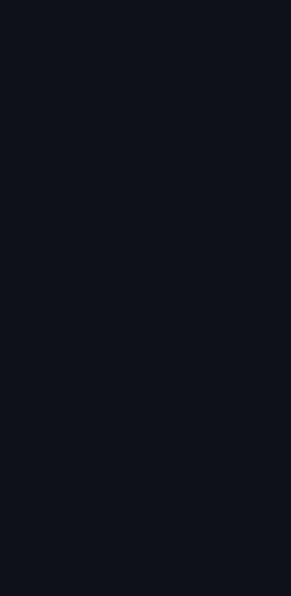

# Profile Pair Reflections

Profiles tested:
- High-Energy Pop
- Chill Lofi
- Deep Intense Rock
- Adversarial - High Energy Sad Acoustic
- Adversarial - Chill Max Energy
- Adversarial - Missing Genre

## Pairwise comparisons

1. High-Energy Pop vs Chill Lofi: High-Energy Pop pushes songs like "Gym Hero" and "Storm Runner," while Chill Lofi shifts to "Library Rain" and "Midnight Coding" because lower target energy plus acoustic preference rewards softer, more acoustic tracks.
2. High-Energy Pop vs Deep Intense Rock: Both profiles keep high-energy songs near the top, but Deep Intense Rock puts "Storm Runner" first because it matches both rock and intense mood, while High-Energy Pop puts "Sunrise City" first due to happy pop alignment.
3. High-Energy Pop vs Adversarial - High Energy Sad Acoustic: The sad-acoustic profile still gets "Gym Hero" and "Sunrise City," which shows energy closeness can overpower mood mismatch when there are few songs with both very high energy and high acousticness.
4. High-Energy Pop vs Adversarial - Chill Max Energy: The max-energy chill profile unexpectedly keeps lofi songs like "Midnight Coding" near the top because exact lofi + chill matches add enough points to beat many high-energy songs.
5. High-Energy Pop vs Adversarial - Missing Genre: With missing genre, top songs become a broader mix like "Rooftop Lights" and "Golden Hour Glow," which makes sense because the model falls back to mood, energy closeness, and electronic preference.
6. Chill Lofi vs Deep Intense Rock: Chill Lofi favors low-energy acoustic songs, while Deep Intense Rock favors high-energy low-acoustic songs, so their top lists almost fully split by both energy direction and acoustic direction.
7. Chill Lofi vs Adversarial - High Energy Sad Acoustic: Chill Lofi keeps calm tracks at the top, but high-energy sad acoustic pulls in "Gym Hero" and "Neon Horizon" because the high energy target dominates even though acoustic preference is set to true.
8. Chill Lofi vs Adversarial - Chill Max Energy: Both want lofi and chill, but Chill Max Energy introduces very energetic songs like "Iron Sky" in the top five because the target energy is pushed to the maximum.
9. Chill Lofi vs Adversarial - Missing Genre: Chill Lofi gets mostly acoustic chill songs, while Missing Genre shifts to brighter, lower-acoustic tracks since genre points disappear and electronic preference becomes more important.
10. Deep Intense Rock vs Adversarial - High Energy Sad Acoustic: Both profiles rank high-energy songs high, but Deep Intense Rock gives a clear advantage to "Storm Runner" because both genre and mood match, while the sad-acoustic profile has no strong mood matches in the dataset.
11. Deep Intense Rock vs Adversarial - Chill Max Energy: Deep Intense Rock prioritizes intense rock-like tracks, while Chill Max Energy still keeps lofi songs near the top because exact genre and mood matches can still beat pure energy matches.
12. Deep Intense Rock vs Adversarial - Missing Genre: Missing Genre removes rock points and spreads recommendations across multiple genres, which shows how much personalization drops when a key preference field is unavailable.
13. Adversarial - High Energy Sad Acoustic vs Adversarial - Chill Max Energy: Both are adversarial, but the first behaves like a high-energy profile and the second behaves like a lofi/chill profile, showing that mood and genre exact matches can redirect results even under unusual settings.
14. Adversarial - High Energy Sad Acoustic vs Adversarial - Missing Genre: Missing Genre gives a more diverse top five, while High Energy Sad Acoustic repeats high-energy songs, because one profile has no genre anchor and the other has a strong energy anchor.
15. Adversarial - Chill Max Energy vs Adversarial - Missing Genre: Chill Max Energy still keeps lofi/chill songs at the top thanks to exact matches, while Missing Genre leans toward medium-high energy and low acousticness due to fallback scoring behavior.

## Plain-language takeaway

"Gym Hero" keeps showing up for users who want "Happy Pop" because it has very high energy and very low acousticness, and those two factors are heavily rewarded in the current formula. Even when mood is imperfect, the energy bonus is large enough to keep it near the top.

## New Tabulate Output

I switched the terminal output to a table so it is easier to read.
The screenshot below shows the updated format with advanced columns (popularity, decade, mood tags, instrumentalness, liveness, speechiness, and time signature) in addition to score and reasons.

## Advanced Dataset and Scoring Changes

### What changed in the dataset

I expanded the catalog from 18 songs to 100 songs and introduced advanced features to make personalization richer:

- popularity (0-100)
- release_decade (e.g., 1970, 1980, 1990, 2000, 2010, 2020)
- mood_tags (multi-tag text like `bright|feel-good|sunny`)
- instrumentalness (0.0-1.0)
- liveness (0.0-1.0)
- speechiness (0.0-1.0)
- musical_key (e.g., C, F#, A)
- time_signature (3, 4, 5, 7)

These features make the recommendations less one-dimensional, especially in edge cases where genre or mood alone is not enough.

### New math-based scoring rules

In addition to genre, mood, energy, and acousticness, the recommender now applies these quantitative rules:

- Popularity boost:
	popularity_score = (popularity / 100) * 1.5
- Era fit based on nearest preferred decade:
	decade_closeness = max(0, 1 - (nearest_decade_gap / 60))
	decade_score = decade_closeness * 1.4
- Mood-tag overlap (Jaccard-style):
	tag_similarity = |target_tags ∩ song_tags| / |target_tags ∪ song_tags|
	tag_score = tag_similarity * 1.6
- Instrumental preference:
	if likes_acoustic: instrumental_score = instrumentalness * 0.9
	else: instrumental_score = (1 - instrumentalness) * 0.9
- Liveness fit:
	liveness_score = max(0, 1 - abs(song_liveness - target_liveness)) * 0.8
- Speechiness tolerance:
	over_tolerance = max(0, speechiness - tolerance)
	speechiness_score = max(0, 1 - (2 * over_tolerance)) * 0.9
- Optional rhythmic bonus:
	+0.4 if time_signature matches the preferred_time_signature

### Impact on recommendation behavior

The upgraded model produces recommendations that are more explainable and stylistically nuanced:

- Popular tracks now get a controlled advantage, but cannot dominate by popularity alone.
- Users with nostalgic or era-driven preferences are better represented through decade matching.
- Songs with semantically aligned mood tags (not just exact mood label matches) are rewarded.
- Acoustic vs vocal-forward balance is now captured by instrumentalness, not only acousticness.
- Speech-heavy tracks are penalized for users who prefer less spoken-word content.

Overall, the new feature set reduces brittle behavior in adversarial profiles and makes top-k results feel more like realistic playlist curation.
